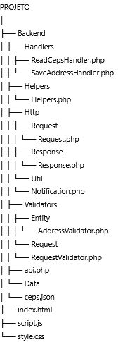
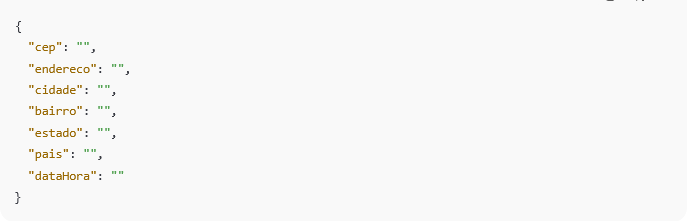

# Projeto EMSoft Sistemas

## Estrutura do Projeto



## Requisitos

- PHP >= 8.0  
- Servidor com suporte para PHP (Windows, Linux, Mac)

## Como instalar o PHP

Siga as instruções oficiais do PHP para instalar no seu sistema operacional:

- [Instalando PHP no Windows](https://www.php.net/manual/en/install.windows.php)  
- [Instalando PHP no Linux](https://www.php.net/manual/en/install.unix.php)  
- [Instalando PHP no macOS](https://www.php.net/manual/en/install.macos.php)  

## Como acessar a aplicação


Abra o navegador e acesse:
http://localhost:8000 no navegador

Se quiser usar um cliente HTTP (Postman, Insomnia, curl, etc), utilize o endpoint:
http://localhost:8000/Backend/api.php

Formato esperado do JSON para requisições: 



## Como executar o servidor

No terminal, navegue até a pasta raiz do projeto (onde está o arquivo `api.php`) e execute o comando:

```bash
php -S localhost:8000  
