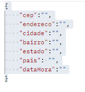

# 📦 Projeto - Busca CEP

Este projeto é um desafio proposto pela empresa


---

## 📌 Requisitos

Para executar este projeto, você precisa ter instalado:

- **PHP 7.4+** (versões mais recentes também funcionam)
- **Servidor embutido do PHP** ou qualquer servidor local (Apache, Nginx, XAMPP, WAMP, Laragon etc.)
- **Navegador moderno** (Chrome, Firefox, Edge…)

---

## 📥 Instalação das Dependências

Este projeto **não possui dependências externas**, portanto nenhuma instalação adicional é necessária.

Caso utilize um ambiente como XAMPP ou WAMP, basta colocar o projeto dentro da pasta:

- `htdocs` (XAMPP)
- `www` (WAMP)
- `www` (Laragon)

---
## Acessando pelo navegador
Basta por o seguinte link na url após iniciar o servidor : localhost:8000
## Para acessar por um cliente HTTP
Basta enviar a requisição para http://localhost:8000/Backend/api.php

com os seguinte payload :



## ▶️ Como executar o servidor

Se quiser rodar usando o **servidor embutido do PHP**, navegue até a pasta do projeto pelo terminal e execute:

```bash
php -S localhost:8000
